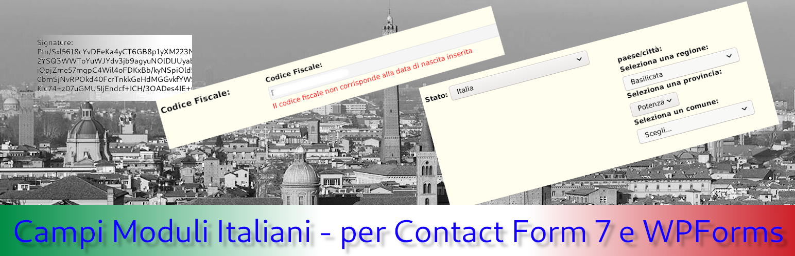
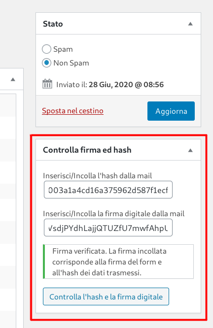
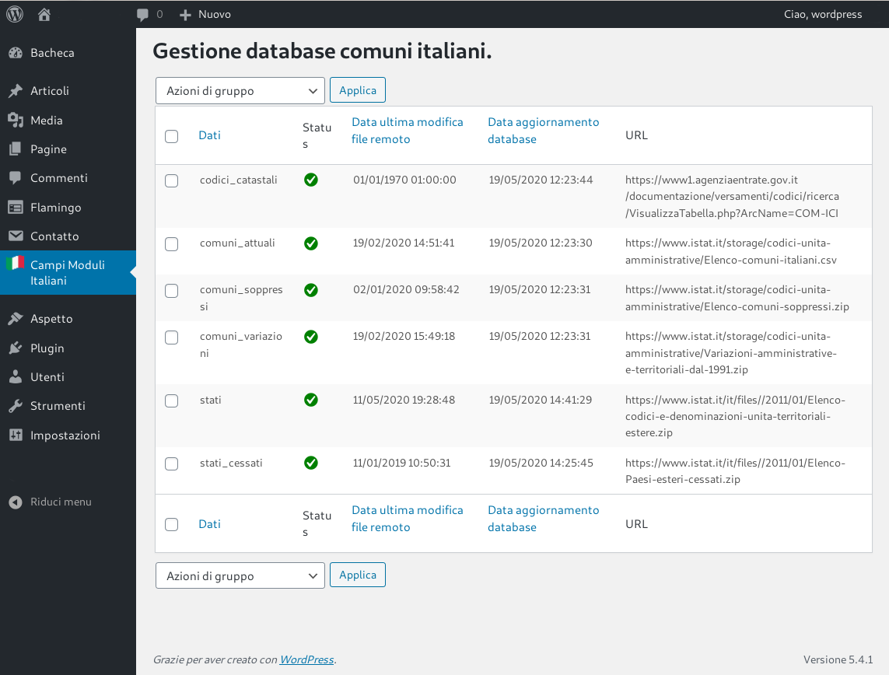

# Campi Moduli Italiani #

**Campi Moduli Italiani** is a WordPress plugin to create useful fields for Italian sites, to be used in the forms produced with Contact Form 7 and WPForms.

**Install it now:**
[https://wordpress.org/plugins/campi-moduli-italiani/](https://wordpress.org/plugins/campi-moduli-italiani/)

## Description ##
This plugin creates form tags for Contact Form 7 and form fields for WPForms.

### Contact Form 7 ###
4 form-tags (and corresponding mail-tags) are available in this version:
* [comune]: creates a series of select for the selection of an Italian municipality
* [cf]: creates a field for entering the Italian tax code of a natural person
* [stato]: creates the ability to select a country
* [formsign]: creates the possibility to digitally sign the e-mails sent with a private key attributed to each individual form

### WPForms ###
2 fields types are available:
* Cascade selection of an Italian municipality (returning Istat's municipality code as value)
  Since version 2.2.0 it is possible to create filters to limit to a list the municipalities shown by the field.
* A field to select a state (returning Istat's country code as value)

## Data used ##
At the time of activation, the plugin downloads the data it uses from the Istat and from the Italian Revenue Agency websites. This data can be updated from the administration console.
Downloading and entering data into the database takes several minutes: be patient during the activation phase.
The selection of the municipalities was created starting from the code of https://wordpress.org/plugins/regione-provincia-comune/

This plugin uses data made available by ISTAT and the Agenzia delle entrate (Italian revenue agency).
In particular, data made available at these URLs are acquired and stored:

* https://www.istat.it/it/archivio/6789
* https://www.istat.it/it/archivio/6747
* https://www1.agenziaentrate.gov.it/servizi/codici/ricerca/VisualizzaTabella.php?ArcName=00T4

The data published on the ISTAT website are covered by a Creative Commons license - Attribution (CC-by) (https://creativecommons.org/licenses/by/3.0/it/), as indicated here: https://www.istat.it/it/note-legali
The data taken from the website of the Agenzia delle entrate are in the public domain and constitute a public database made available to allow tax compliance and, more generally, to allow the identification of physical persons with the Italian public administrations, through the personal fiscal code.
The data are managed by the Ufficio Archivio of the Agenzia delle entrate.
By Italian law (art. 52 d.lgs. 82/2005) all data, that are not personal data, published by an Italian administration without an explicit license are open data (CC0).
This plugin uses the data taken from the website of the Agenzia delle entrate exclusively for the purpose of carrying out a formal regularity check of the pesonal tax code.
This plugin does not include any links on the external pages of the website on which it is used, neither to the Agenzia delle entrate's site nor to the ISTAT's website; in particular, no kind of direct link is made, nor of deep linking.

## How to use form tags in Contact Form 7 ##

[comune]
`[comune]` has a manager in the CF7 form creation area that allows you to set various options.
In particular, it is possible to set the "kind" attribute to "tutti" (all); "attuali" (current), "evidenza_cessati" (evidence ceased). In the first and third cases, in different ways, both the currently existing municipalities and those previously closed are proposed (useful, for example, to allow the selection of the municipality of birth). In the "attuali" mode, however, only the selection of the currently existing municipalities is allowed (useful to allow the selection of the Municipality of residence / domicile).
It is also possible to set the "comu_details" option, to show an icon after the select cascade that allows the display of a modal table with the statistical details of the territorial unit.
The value returned by the group is always the ISTAT code of the selected municipality. The corresponding mail-tag converts this value into the name of the municipality followed by the indication of the automotive code of the province.
From version 1.1.1 hidden fields are also populated with the strings corresponding to the denomination of the region, province and municipality selected, useful for being used in plugins that directly capture the data transmitted by the form (such as "Send PDF for Contact Form 7" )
The cascade of select can also be used outside of CF7, using the [comune] shortcode (options similar to those of the form tag for Contact Form 7).
Since version 2.2.0 it is possible to create filters to limit to a list the municipalities shown by the field.

[cf]
`[cf]` has a manager in the CF7 form creation area that allows you to set the various options.
In particular, it is possible to set various validation options allowing you to find the correspondence of the tax code with other fields of the form.
Specifically, it is possible to verify that the tax code corresponds with the foreign state of birth (selected by means of a select [stato]), the Italian municipality of birth (selected by means of a cascade of select [comune]), gender (indicating the name of a form field that returns "M" or "F"), the date of birth. If multiple fields are used to select the date of birth, one for the day, one for the month and one for the year, it is possible to find the correspondence of the tax code with these values.

[stato]
`[stato]` has a manager in the CF7 form creation area that allows you to set various options.
In particular, it is possible to set the selection of only the currently existing states ("only_current" option) and it is possible to set the "use_continent" option to have the select values divided by continent. The field always returns the ISTAT code of the foreign state (code 100 for Italy). The ISTAT code is the type of data expected by [cf], for the verification of the tax code.

[formsign]
`[formsign]` now has a manager in the CF7 form creation area.
To use it, simply insert the tag followed by the field name in your own form: for example [formsign firmadigitale]. This tag will create a hidden field in the form with attribute name = "firmadigitale" and no value.
To use the code, it is also necessary to insert the [firmadigitale] mail-tag in the email or emails that the form sends (it is recommended at the end of the email).
In this way, in the email body it will be written a two-lines sequence containing:
an md5 hash of the data transmitted with the module (not of the content of any attached files)
a digital signature of the hash.
If you use html email, you can style the output using a wp option named: "gcmi-forsign-css" with a css as value.
The signature is affixed by generating a pair of RSA keys, attributed to each form.
By checking the hash and the signature, it will be possible to verify that the emails have actually been sent by the form and that the data transmitted by the user correspond to what has been registered.
To facilitate data feedback, it is preferable to use "Flamingo" for archiving sent messages. In fact, in the Flamingo admin screen, a specific box is created that allows feedback of the hash and the digital signature entered in the email.
The system is useful in the event that through the form it is expected to receive applications for registration or applications etc... and avoids disputes regarding the data that the candidates claim to have sent and what is recorded by the system in Flamingo.

## Code

Want to check the code? [https://github.com/MocioF/campi-moduli-italiani](https://github.com/MocioF/campi-moduli-italiani)

## Installation ##

### Automatic installation ###

1. Plugin admin panel and `add new` option.
2. Search in the text box `campi-moduli-italiani`.
3. Position yourself on the description of this plugin and select install.
4. Activate the plugin from the WordPress admin panel.
NOTE: activation takes several minutes, because the updated data tables are downloaded from the official sites (Istat and Agenzia delle entrate and then the data is imported into the database)

### Manual installation of ZIP files ###

1. Download the .ZIP file from this screen.
2. Select add plugin option from the admin panel.
3. Select `upload` option at the top and select the file you downloaded.
4. Confirm installation and activation of plugins from the administration panel.
NOTE: activation takes several minutes, because the updated data tables are downloaded from the official sites (Istat and Agenzia delle entrate and then the data is imported into the database)

### Manual FTP installation ###

1. Download the .ZIP file from this screen and unzip it.
2. FTP access to your folder on the web server.
3. Copy the whole `campi-moduli-italiani` folder to the `/wp-content/plugins/` directory
4. Activate the plugin from the WordPress admin panel.
NOTE: activation takes several minutes, because the updated data tables are downloaded from the official sites (Istat and Agenzia delle entrate and then the data is imported into the database)

## Frequently Asked Questions ##

### How to get default values from the context ? ###
Since version 1.2, [comune], [stato] and [cf] support standard Contact Form 7 method to get values from the context.
More, all of them support predefined values in tag.
Look here for more informations: https://contactform7.com/getting-default-values-from-the-context/
[comune] uses javascript to be filled with default or context value.

### How do I report a bug? ###
You can create an issue in our Github repo:
[https://github.com/MocioF/campi-moduli-italiani](https://github.com/MocioF/campi-moduli-italiani)

## Screenshots ##

|![Image of the [stato] and [comune] form tags in a form](assets/screenshot-1.png)|![Image of the form-tag [cf] in a form](assets/screenshot-2.png)|![Image of the "digital signature" block inserted at the bottom of an email using the form-tag [formsign]](assets/screenshot-3.png)|||
| :---: | :---: | :---: | :---: | :---: |
| Image of the [stato] and [comune] form tags in a form | Image of the form-tag [cf] in a form | Image of the "digital signature" block inserted at the bottom of an email using the form-tag [formsign] | Image of the hash code verification meta-box and digital signature in Flamingo | Image of the admin screen, from which it is possible to update the data |

## License ##

Campi Moduli Italiani is an Open Source project licensed under [GPL v2](./LICENSE.txt).

## Contributions, Issues, Bugs ##

Plugin code is hosted on a public repository on [GitHub](https://github.com/MocioF/campi-moduli-italiani).
Reach me over there to help and suggest.

## Open Source contributors ##

|  |
| :---: |
| [MocioF](https://github.com/MocioF) |